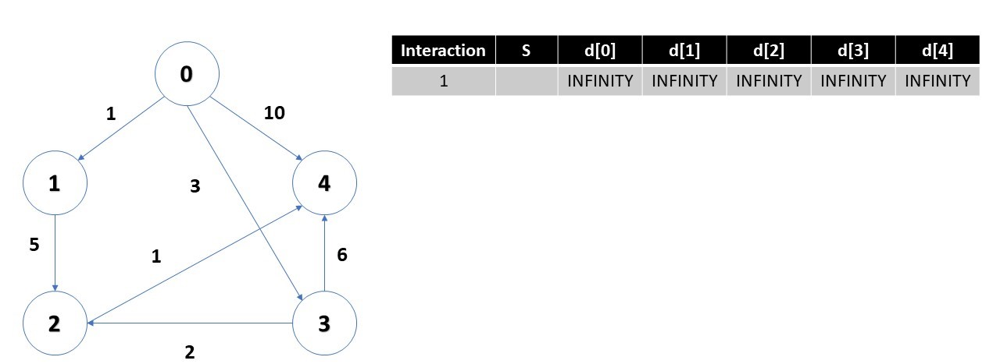
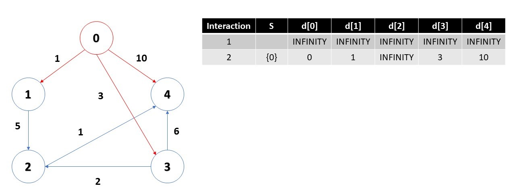
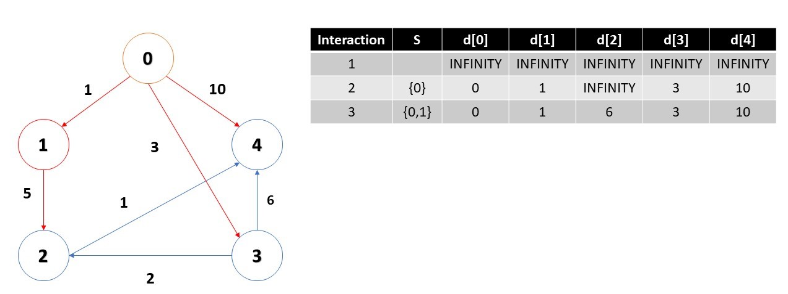
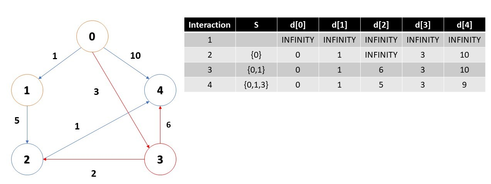
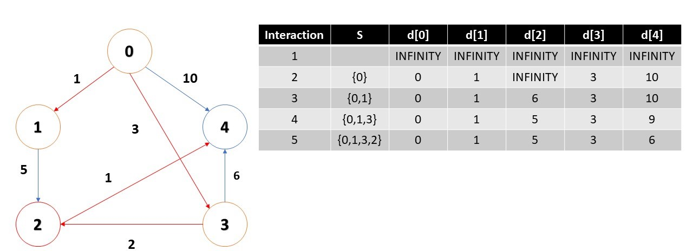
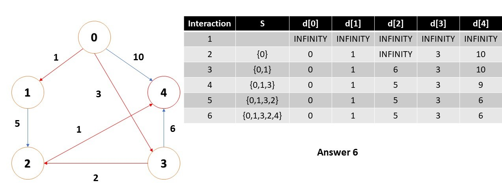

# Dijkstras-Algorithm-Ruby

Dijkstra's algorithm, is an algorithm to find the shortest path between nodes in a graph, which may represent, for example, road networks. This algorithm was created by computer scientist Edsger W. Dijkstra.

The algorithm works with a set S of shortest paths, starting with an initial vertex I. The algorithm searches the vertices belonging to S for the vertex with the smallest distance relative to I and adds it to S. Repeating until all vertices achievable by I are in S.

## Algorithm

The first definition of the initial node. We have to know or the shortest path from the initial node to the Y node. Dijkstra's algorithm assigns some initial distance values and tries to improve them step by step.

1. Mark all nodes as not visited. Create a set of all unvisited nodes called an unvisited set.
2. Assign the zero and infinite starting node to all other nodes. Set the starting node to current.
3. For the current node, consider all of your unvisited neighbors and calculate your tentative distances through the current node. Compare the recently calculated temporary distance with the current assigned value and assign the shortest.
4. When we are finished considering all unvisited neighbors for the current node, mark the current node as visited and remove it from the unvisited set. A visited node will never be scanned again.
5. If the destination node has been marked as visited or if the shortest tentative distance between the nodes in the unvisited set is infinite stops, the algorithm has ended.
6. Otherwise, select the unvisited node marked with the shortest temporary distance, configure it as the new "current node" and go back to step 3.

## Example

